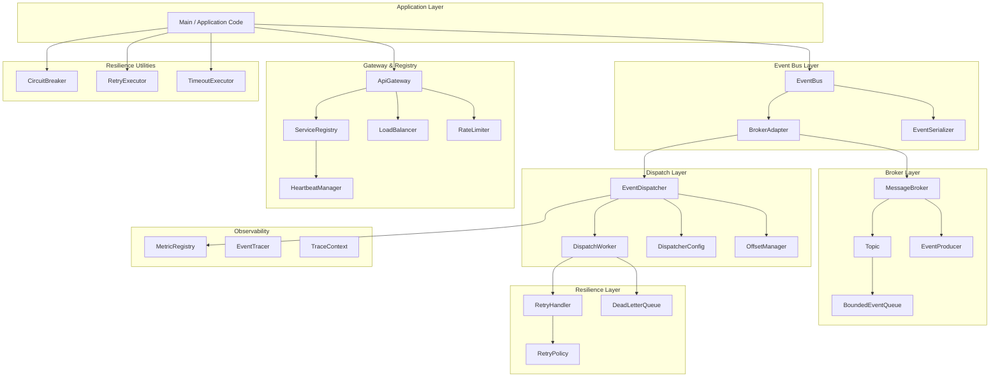
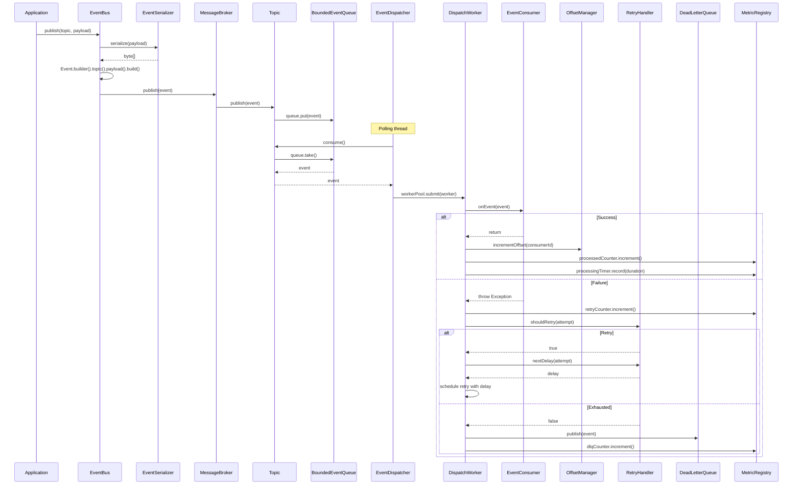

# event-driven-microframework

A lightweight, in-process event-driven framework for Java applications that provides message brokering, service discovery, API gateway routing, resilience patterns, and observability — all without external dependencies.

This framework is designed for developers who need event-driven communication within a single JVM process. It combines a topic-based message broker with an event bus abstraction, service registry, circuit breaker, retry and timeout executors, rate limiting, load balancing, distributed tracing primitives, and metrics collection.

The core concepts are **events**, **topics**, **consumers**, **dispatchers**, and **the event bus** — a simplified API that hides the underlying broker complexity.

---

## Why this project?

### Why event-driven architecture?

Event-driven architectures decouple event producers from event consumers. A producer publishes an event without knowing which consumers will process it. Consumers subscribe to topics of interest without knowing which producers created the events. This decoupling makes systems easier to extend, test, and maintain.

### Why this framework exists

Most event-driven solutions require external infrastructure — RabbitMQ, Kafka, Redis, or cloud-based message queues. This adds operational complexity, network latency, and deployment overhead. This framework provides the same conceptual model (topics, consumers, offsets, retries, dead-letter queues) entirely in-process, using Java threads and in-memory data structures.

### When to use it

- You need event-driven communication within a single JVM process.
- You want to prototype or build small-to-medium applications with event-driven architecture.
- You want to learn how event-driven systems work by reading and modifying the source.
- You need resilience patterns (circuit breaker, retry, timeout) alongside your event processing.
- You want built-in service discovery, API gateway routing, and rate limiting without external infrastructure.

### When not to use it

- You need persistent, durable message storage across process restarts.
- You need to distribute events across multiple JVMs or machines.
- You need high-throughput, low-latency event processing at Kafka scale.
- You need integration with external message brokers (RabbitMQ, Kafka, etc.) — though the architecture supports adding adapters.
- You need guaranteed exactly-once delivery semantics.

---

## Core Concepts

| Concept | Description |
|---|---|
| **Event** | An immutable message with an ID, topic name, byte-array payload, timestamp, and headers. Created via a builder. |
| **Topic** | A named channel that holds a bounded queue of events. Producers publish to topics; consumers read from topics. |
| **Event Consumer** | An interface with `onEvent(Event)` and `getConsumerId()`. Implementations process events published to a topic. |
| **Consumer Group** | A logical grouping of consumers for a topic. Consumers are registered per topic. |
| **Event Producer** | A wrapper around the message broker that sends events. |
| **Message Broker** | The central hub that manages topics and routes events. Topics are created lazily on first access. |
| **Event Dispatcher** | Pulls events from topics and distributes them to registered consumers using a thread pool. Manages retries, offsets, and dead-letter queues. |
| **Dispatch Worker** | A `Runnable` that delivers a single event to a single consumer. Handles success (offset increment, metrics recording) and failure (retry or dead-letter). |
| **Offset Manager** | Tracks per-consumer progress by incrementing an offset counter after successful event processing. |
| **Bounded Event Queue** | A bounded `ArrayBlockingQueue` that backs each topic. Supports three backpressure policies: `BLOCK`, `REJECT`, `DROP`. |
| **Retry Handler** | Determines whether to retry a failed event and computes the delay using exponential backoff. |
| **Dead Letter Queue** | A separate topic (named `{originalTopic}.DLQ`) that stores events that exhausted all retry attempts. |
| **Event Bus** | A higher-level abstraction over the broker and dispatcher. Provides `createTopic`, `publish`, and `subscribe` with automatic serialization/deserialization. |
| **Event Serializer** | Serializes/deserializes event payloads using Java's built-in serialization. |
| **Service Registry** | An in-memory registry of service instances, keyed by service name. Supports register, deregister, and lookup. |
| **Service Instance** | Represents a registered service with a name, instance ID, host, port, metadata, and heartbeat timestamp. |
| **Heartbeat Manager** | Periodically removes stale service instances whose heartbeat has expired beyond a configurable TTL. |
| **Health Check** | An interface for custom health-check logic on service instances. |
| **API Gateway** | Routes requests to service instances based on path definitions. Applies rate limiting and load balancing. |
| **Load Balancer** | Round-robin selection from a list of service instances. |
| **Rate Limiter** | Per-client sliding-window rate limiter with configurable max requests and window duration. |
| **Route Definition** | Maps a request path to a service name. |
| **Circuit Breaker** | Tracks failure count and transitions between `CLOSED`, `OPEN`, and `HALF_OPEN` states. After a timeout, allows probe requests. |
| **Retry Executor** | Retries a `Callable` up to a configurable number of attempts with a fixed delay between attempts. |
| **Timeout Executor** | Executes a `Callable` with a configurable timeout using `Future.get()`. |
| **Metric Registry** | Holds counters, gauges, and timers. Provides a `printAll()` snapshot. |
| **Counter** | An atomic long counter with `increment()` and `increment(long)`. |
| **Gauge** | A point-in-time metric backed by a `Supplier<Long>`. |
| **Timer** | Records duration values and computes the average and count. |
| **Event Tracer** | Static utility that prints timestamped, correlation-ID-enriched log messages. |
| **Trace Context** | A `ThreadLocal<String>` that holds the current correlation ID. |
| **Correlation ID Generator** | Generates UUID-based correlation IDs. |
| **Framework Bootstrap** | The entry point that constructs and wires all components: broker, dispatcher, event bus, service registry, heartbeat manager, circuit breaker, retry executor, timeout executor, API gateway, load balancer, and rate limiter. |

---

## Features

### Event Broker
- Topic-based publish/subscribe messaging
- Bounded queues with configurable capacity
- Three backpressure policies: `BLOCK`, `REJECT`, `DROP`
- Per-consumer offset tracking
- Consumer groups per topic

### Event Dispatcher
- Multi-threaded event dispatch via thread pool
- Configurable worker thread count and shutdown timeout
- Automatic retry with exponential backoff
- Dead-letter queue for events that exhaust retries
- Metrics recording for processed events, retries, DLQ, and processing time

### Event Bus
- Simplified API: `createTopic`, `publish`, `subscribe`
- Automatic Java serialization/deserialization of payloads
- Lambda-friendly `EventHandler` interface

### Service Registry
- In-memory service instance registration and discovery
- Automatic stale-instance cleanup via heartbeat TTL
- Random instance selection

### API Gateway
- Path-based route definitions
- Round-robin load balancing
- Per-client sliding-window rate limiting

### Resilience
- Circuit breaker with three states (CLOSED, OPEN, HALF_OPEN)
- Configurable failure threshold and open timeout
- Retry executor with configurable attempts and delay
- Timeout executor with configurable timeout per call

### Observability
- Counters, gauges, and timers
- Metric snapshot printing
- Correlation ID propagation via `ThreadLocal`
- Timestamped trace logging

---

## Architecture Overview

The framework is organized in layered components. The `FrameworkBootstrap` class wires them together.



### Component Interaction Flow

1. **Initialization**: `FrameworkBootstrap` creates the `MessageBroker`, `EventDispatcher`, `EventBus`, `ServiceRegistry`, `HeartbeatManager`, `ApiGateway`, `CircuitBreaker`, `RetryExecutor`, and `TimeoutExecutor`.
2. **Topic Creation**: The application calls `eventBus.createTopic("name", capacity)`, which creates a `Topic` with a `BoundedEventQueue` and starts the dispatcher thread for that topic.
3. **Subscription**: The application calls `eventBus.subscribe(topic, consumerId, handler)`, which registers an `EventConsumer` with the dispatcher.
4. **Publishing**: The application calls `eventBus.publish(topic, payload)`, which serializes the payload, wraps it in an `Event`, and publishes it to the broker.
5. **Dispatching**: The dispatcher's polling thread consumes events from the topic queue and submits `DispatchWorker` tasks to the thread pool for each registered consumer.
6. **Processing**: Each `DispatchWorker` calls `consumer.onEvent(event)`. On success, it increments the offset and records metrics. On failure, it either schedules a retry (with exponential backoff) or sends the event to the dead-letter queue.
7. **Shutdown**: `framework.shutdown()` stops the dispatcher, heartbeat manager, and timeout executor.

---

## Repository Structure

```
src/main/java/com/framework/
├── Main.java                          # Example application entry point
├── bootstrap/
│   └── FrameworkBootstrap.java        # Wires all components together
├── broker/
│   ├── consumer/
│   │   ├── ConsumerGroup.java         # Groups consumers by topic
│   │   ├── EventConsumer.java         # Interface for event consumers
│   │   └── OffsetManager.java         # Tracks per-consumer offsets
│   ├── core/
│   │   ├── Event.java                 # Immutable event with builder
│   │   ├── MessageBroker.java         # Central topic manager
│   │   └── Topic.java                 # Named channel with bounded queue
│   ├── dispatcher/
│   │   ├── DispatcherConfig.java      # Thread pool configuration
│   │   ├── DispatchWorker.java        # Per-event delivery task
│   │   └── EventDispatcher.java       # Polls topics, dispatches to consumers
│   ├── dlq/
│   │   └── DeadLetterQueue.java       # Stores failed events
│   ├── exception/
│   │   ├── BackpressureException.java # Queue full with REJECT policy
│   │   ├── BrokerException.java       # Base broker exception
│   │   └── TopicNotFoundException.java# Topic not found
│   ├── producer/
│   │   └── EventProducer.java         # Wraps broker for sending events
│   ├── queue/
│   │   ├── BoundedEventQueue.java     # ArrayBlockingQueue with policies
│   │   └── QueuePolicy.java           # BLOCK, REJECT, DROP
│   └── retry/
│       ├── RetryHandler.java          # Retry decision and delay computation
│       └── RetryPolicy.java           # Max attempts, initial delay, multiplier
├── eventbus/
│   ├── BrokerAdapter.java             # Bridges EventBus to broker/dispatcher
│   ├── EventBus.java                  # High-level publish/subscribe API
│   ├── EventHandler.java              # Functional interface for handlers
│   └── EventSerializer.java           # Java serialization for payloads
├── gateway/
│   ├── ApiGateway.java                # Routes requests with rate limiting + LB
│   ├── LoadBalancer.java              # Round-robin instance selection
│   ├── RateLimiter.java               # Sliding-window per-client limiter
│   └── RouteDefinition.java           # Path-to-service mapping
├── metrics/
│   ├── Counter.java                   # Atomic long counter
│   ├── Gauge.java                     # Supplier-backed point-in-time value
│   ├── MetricRegistry.java            # Registry for counters, gauges, timers
│   └── Timer.java                     # Duration recording with average
├── registry/
│   ├── HealthCheck.java               # Interface for instance health checks
│   ├── HeartbeatManager.java          # Periodic stale-instance cleanup
│   ├── ServiceInstance.java           # Registered service metadata
│   └── ServiceRegistry.java           # In-memory service registry
├── resilience/
│   ├── CircuitBreaker.java            # Failure threshold with state machine
│   ├── RetryExecutor.java             # Retry wrapper for Callables
│   └── TimeoutExecutor.java           # Timeout wrapper for Callables
└── tracing/
    ├── CorrelationIdGenerator.java    # UUID-based ID generation
    ├── EventTracer.java               # Timestamped, CID-enriched logging
    └── TraceContext.java              # ThreadLocal correlation ID holder
```

### Package Responsibilities

| Package | Responsibility |
|---|---|
| `bootstrap` | Application initialization and dependency wiring |
| `broker.core` | Core domain: Event, Topic, MessageBroker |
| `broker.consumer` | Consumer interface, grouping, and offset tracking |
| `broker.producer` | Producer wrapper for sending events |
| `broker.dispatcher` | Event polling, thread pool dispatch, retry orchestration |
| `broker.queue` | Bounded queue with backpressure policies |
| `broker.retry` | Retry decision logic and exponential backoff |
| `broker.dlq` | Dead-letter queue for failed events |
| `broker.exception` | Broker-specific exception hierarchy |
| `eventbus` | High-level API with serialization abstraction |
| `gateway` | API gateway with routing, load balancing, rate limiting |
| `registry` | Service discovery and heartbeat-based health management |
| `resilience` | Circuit breaker, retry, and timeout patterns |
| `metrics` | In-process counters, gauges, and timers |
| `tracing` | Correlation ID propagation and trace logging |

---

## Installation

### Requirements

- **JDK 17** or later
- **Maven** (for building)

### Dependencies

The framework has zero external dependencies. It uses only the Java standard library.

### Clone and Build

```bash
git clone https://github.com/NASHEDIxCODER/event-driven-microframework.git
cd event-driven-microframework
mvn clean compile
```

### Run the Example

```bash
mvn exec:java -Dexec.mainClass="com.framework.Main"
```

Or compile and run directly:

```bash
mvn compile
java -cp target/classes com.framework.Main
```

---

## Quick Start

```java
import com.framework.bootstrap.FrameworkBootstrap;
import com.framework.eventbus.EventBus;

public class QuickStart {

    public static void main(String[] args) throws Exception {

        // 1. Initialize the framework
        FrameworkBootstrap framework = new FrameworkBootstrap();
        EventBus eventBus = framework.getEventBus();

        // 2. Create a topic with capacity 100
        eventBus.createTopic("orders", 100);

        // 3. Subscribe a consumer
        eventBus.subscribe("orders", "order-processor", payload -> {
            System.out.println("Received: " + payload);
        });

        // 4. Publish events
        eventBus.publish("orders", "Order #1234");
        eventBus.publish("orders", "Order #5678");

        // 5. Wait for async processing
        Thread.sleep(2000);

        // 6. Shutdown
        framework.shutdown();
    }
}
```

### What happens

1. `FrameworkBootstrap` creates the broker, dispatcher, event bus, and all supporting components.
2. `createTopic("orders", 100)` creates a topic with a bounded queue of capacity 100 and starts the dispatcher polling thread.
3. `subscribe` registers a consumer that prints each received payload.
4. `publish` serializes the string payload, wraps it in an `Event`, and publishes it to the broker.
5. The dispatcher polls the topic queue, submits a `DispatchWorker` to the thread pool, which calls the consumer's handler.
6. `shutdown` stops the dispatcher thread pool and heartbeat manager.

---

## API Overview

### `FrameworkBootstrap`

The entry point. Constructs and wires all components.

```java
FrameworkBootstrap framework = new FrameworkBootstrap();

EventBus eventBus = framework.getEventBus();
ApiGateway apiGateway = framework.getApiGateway();
ServiceRegistry serviceRegistry = framework.getServiceRegistry();
CircuitBreaker circuitBreaker = framework.getCircuitBreaker();
RetryExecutor retryExecutor = framework.getRetryExecutor();
TimeoutExecutor timeoutExecutor = framework.getTimeoutExecutor();

framework.shutdown();
```

### `Event` (immutable, builder pattern)

```java
Event event = Event.builder()
    .id("custom-id")                    // optional, auto-generated UUID if omitted
    .topic("orders")                    // required
    .payload("Hello".getBytes())        // required
    .timestamp(System.currentTimeMillis()) // optional, auto-set if omitted
    .header("content-type", "text/plain") // optional
    .headers(Map.of("key", "value"))    // optional, merges with individual headers
    .build();

String id = event.getId();
String topic = event.getTopic();
byte[] payload = event.getPayload();
long timestamp = event.getTimestamp();
Map<String, String> headers = event.getHeaders();
```

### `EventBus`

```java
EventBus eventBus = framework.getEventBus();

// Create a topic
eventBus.createTopic("orders", 100);

// Publish an event (payload is serialized automatically)
eventBus.publish("orders", "Hello World");
eventBus.publish("orders", 42);
eventBus.publish("orders", mySerializableObject);

// Subscribe a handler
eventBus.subscribe("orders", "consumer-1", payload -> {
    System.out.println("Got: " + payload);
});
```

### `EventConsumer` (interface)

```java
public interface EventConsumer {
    String getConsumerId();
    void onEvent(Event event) throws Exception;
}
```

### `EventProducer`

```java
MessageBroker broker = new MessageBroker(1000);
EventProducer producer = new EventProducer(broker);

Event event = Event.builder().topic("orders").payload(data).build();
producer.send(event);
```

### `MessageBroker`

```java
MessageBroker broker = new MessageBroker(1000); // default topic capacity

broker.createTopic("orders");                    // create with default capacity
broker.getTopic("orders");                       // get existing topic
broker.publish(event);                           // publish to topic
broker.listTopics();                             // Set<String> of topic names
broker.topicExists("orders");                    // boolean
```

### `Topic`

```java
Topic topic = new Topic("orders", 100);
topic.publish(event);
Event consumed = topic.consume();
int size = topic.size();
```

### `EventDispatcher`

```java
DispatcherConfig config = new DispatcherConfig(4, 5000); // 4 threads, 5s timeout
EventDispatcher dispatcher = new EventDispatcher(config);

dispatcher.registerConsumer("orders", consumer);
dispatcher.start(topic);
dispatcher.shutdown();
```

### `DispatcherConfig`

```java
new DispatcherConfig(workerThreads, shutdownTimeoutMillis);
```

### `BoundedEventQueue` and `QueuePolicy`

```java
BoundedEventQueue queue = new BoundedEventQueue(100, QueuePolicy.BLOCK);
// QueuePolicy.BLOCK  - block producer when full
// QueuePolicy.REJECT - throw BackpressureException when full
// QueuePolicy.DROP   - silently drop when full

queue.publish(event);
Event event = queue.consume();
int size = queue.size();
```

### `RetryPolicy` and `RetryHandler`

```java
RetryPolicy policy = new RetryPolicy(3, 1000, 2.0);
// maxAttempts=3, initialDelay=1000ms, multiplier=2.0
// Delays: 1000ms, 2000ms, 4000ms

RetryHandler handler = new RetryHandler(policy);
boolean shouldRetry = handler.shouldRetry(attempt);
long delay = handler.nextDelay(attempt);
Event retryEvent = handler.createRetryEvent(originalEvent, attempt);
```

### `DeadLetterQueue`

```java
DeadLetterQueue dlq = new DeadLetterQueue("orders", 1000);
// Creates topic "orders.DLQ" with capacity 1000
dlq.publish(event);
Topic dlqTopic = dlq.getDlqTopic();
```

### `ServiceRegistry`

```java
ServiceRegistry registry = new ServiceRegistry();

ServiceInstance instance = new ServiceInstance("user-service", "localhost", 8080);
registry.register(instance);
registry.deregister("user-service", instance.getInstanceId());

List<ServiceInstance> instances = registry.getInstances("user-service");
Optional<ServiceInstance> random = registry.getRandomInstance("user-service");
Map<String, List<ServiceInstance>> all = registry.getAll();
```

### `ServiceInstance`

```java
ServiceInstance instance = new ServiceInstance("user-service", "localhost", 8080);
instance.getMetadata().put("version", "1.0");
instance.heartbeat(); // updates lastHeartbeat to now
```

### `HeartbeatManager`

```java
HeartbeatManager hm = new HeartbeatManager(registry, 15000, 5000);
// TTL=15s, cleanup every 5s
hm.shutdown();
```

### `HealthCheck` (interface)

```java
public interface HealthCheck {
    boolean isHealthy(ServiceInstance instance);
}
```

### `ApiGateway`

```java
ApiGateway gateway = framework.getApiGateway();

gateway.addRoute(new RouteDefinition("/users", "user-service"));

Optional<ServiceInstance> instance = gateway.route("/users", "client-123");
// Throws RuntimeException if rate limited, route not found, or no instances
```

### `RouteDefinition`

```java
new RouteDefinition("/api/orders", "order-service");
```

### `LoadBalancer`

```java
LoadBalancer lb = new LoadBalancer();
ServiceInstance chosen = lb.choose(instances); // round-robin
```

### `RateLimiter`

```java
RateLimiter limiter = new RateLimiter(100, 60000); // 100 requests per 60s window
boolean allowed = limiter.allow("client-123");
```

### `CircuitBreaker`

```java
CircuitBreaker cb = new CircuitBreaker(3, 10000);
// Opens after 3 failures, stays open for 10s, then half-open

if (cb.allowRequest()) {
    try {
        // do work
        cb.recordSuccess();
    } catch (Exception e) {
        cb.recordFailure();
    }
}

CircuitBreaker.State state = cb.getState(); // CLOSED, OPEN, HALF_OPEN
```

### `RetryExecutor`

```java
RetryExecutor retry = new RetryExecutor(3, 500); // 3 attempts, 500ms delay

String result = retry.execute(() -> {
    return callExternalService();
});
```

### `TimeoutExecutor`

```java
TimeoutExecutor timeout = new TimeoutExecutor();

String result = timeout.execute(() -> {
    return slowOperation();
}, 2000); // 2 second timeout

timeout.shutdown();
```

### `MetricRegistry`

```java
MetricRegistry metrics = new MetricRegistry();

Counter counter = metrics.counter("events.processed");
counter.increment();
counter.increment(5);

Timer timer = metrics.timer("processing.time");
timer.record(150); // 150ms
double avg = timer.getAverage();
long count = timer.getCount();

Gauge gauge = new Gauge(() -> queue.size());
metrics.registerGauge("queue.size", gauge);

metrics.printAll();
// ==== Metrics Snapshot ====
// Counter: events.processed = 6
// Gauge: queue.size = 0
// Timer: processing.time avg=150.0ms count=1
```

### `EventTracer`, `TraceContext`, `CorrelationIdGenerator`

```java
// Set correlation ID
TraceContext.set(CorrelationIdGenerator.generate());

// Trace logging
EventTracer.trace("Event published to topic orders");
// Output: [2026-07-25T19:47:00Z] [CID=550e8400-e29b-41d4-a716-446655440000] Event published to topic orders

// Clear when done
TraceContext.clear();
```

---

## Event Lifecycle



### Lifecycle Steps

1. **Serialization**: The `EventBus` serializes the payload using Java serialization.
2. **Event Creation**: An immutable `Event` is built with a unique ID, topic, serialized payload, timestamp, and headers.
3. **Publishing**: The event is published to the `MessageBroker`, which routes it to the correct `Topic`.
4. **Queuing**: The topic's `BoundedEventQueue` stores the event. If the queue is full, behavior depends on the policy (`BLOCK`, `REJECT`, or `DROP`).
5. **Polling**: The `EventDispatcher` runs a polling thread per topic that calls `topic.consume()` (blocking).
6. **Dispatching**: For each consumed event, the dispatcher submits a `DispatchWorker` to the thread pool for each registered consumer.
7. **Processing**: The `DispatchWorker` calls `consumer.onEvent(event)`.
8. **Success Path**: The offset is incremented, and metrics (counter + timer) are recorded.
9. **Failure Path**: The retry counter is incremented. If retries remain, a new `DispatchWorker` is scheduled with exponential backoff delay. If retries are exhausted, the event is sent to the dead-letter queue.
10. **Completion**: The framework shuts down cleanly via `framework.shutdown()`.

---

## Package Reference

### `com.framework.bootstrap`

**Purpose**: Application initialization and dependency injection.

**Responsibilities**: Creates and wires all framework components: `MessageBroker`, `EventDispatcher`, `EventBus`, `ServiceRegistry`, `HeartbeatManager`, `ApiGateway`, `CircuitBreaker`, `RetryExecutor`, `TimeoutExecutor`.

**Public API**: `FrameworkBootstrap` — constructor, `getEventBus()`, `getApiGateway()`, `getServiceRegistry()`, `getCircuitBreaker()`, `getRetryExecutor()`, `getTimeoutExecutor()`, `shutdown()`.

**Internal API**: None.

**Dependencies**: All other packages.

---

### `com.framework.broker.core`

**Purpose**: Core domain model for the event broker.

**Responsibilities**: Defines `Event` (immutable message), `Topic` (named channel with queue), and `MessageBroker` (topic registry and routing).

**Public API**:
- `Event` — `builder()`, `getId()`, `getTopic()`, `getPayload()`, `getTimestamp()`, `getHeaders()`
- `Event.Builder` — `id()`, `topic()`, `payload()`, `timestamp()`, `header()`, `headers()`, `build()`
- `Topic` — constructor, `getName()`, `publish()`, `consume()`, `size()`
- `MessageBroker` — constructor, `createTopic()`, `getTopic()`, `publish()`, `listTopics()`, `topicExists()`

**Internal API**: None.

**Dependencies**: `broker.queue` (for `BoundedEventQueue`, `QueuePolicy`).

---

### `com.framework.broker.consumer`

**Purpose**: Consumer abstraction and offset tracking.

**Responsibilities**: Defines the `EventConsumer` interface, groups consumers via `ConsumerGroup`, and tracks per-consumer progress via `OffsetManager`.

**Public API**:
- `EventConsumer` — `getConsumerId()`, `onEvent(Event)`
- `ConsumerGroup` — constructor, `getTopic()`, `addConsumer()`, `getConsumers()`
- `OffsetManager` — `initializeConsumer()`, `getOffset()`, `incrementOffset()`

**Internal API**: None.

**Dependencies**: `broker.core` (for `Event`).

---

### `com.framework.broker.producer`

**Purpose**: Producer wrapper for sending events.

**Responsibilities**: Provides a `send(Event)` method that delegates to `MessageBroker.publish()`.

**Public API**: `EventProducer` — constructor, `send(Event)`.

**Internal API**: None.

**Dependencies**: `broker.core` (for `Event`, `MessageBroker`).

---

### `com.framework.broker.dispatcher`

**Purpose**: Event polling, dispatch, and retry orchestration.

**Responsibilities**: Polls topics for events, submits `DispatchWorker` tasks to a thread pool, manages retry scheduling, and records metrics.

**Public API**:
- `EventDispatcher` — constructor, `registerConsumer()`, `start(Topic)`, `shutdown()`
- `DispatcherConfig` — constructor, `getWorkerThreads()`, `getShutdownTimeoutMillis()`

**Internal API**:
- `DispatchWorker` — `Runnable` implementation, package-private constructor

**Dependencies**: `broker.consumer`, `broker.core`, `broker.retry`, `broker.dlq`, `metrics`.

---

### `com.framework.broker.queue`

**Purpose**: Bounded queue with backpressure policies.

**Responsibilities**: Wraps `ArrayBlockingQueue` with three policies: `BLOCK` (block producer), `REJECT` (throw exception), `DROP` (silently discard).

**Public API**:
- `BoundedEventQueue` — constructor, `publish(Event)`, `consume()`, `size()`
- `QueuePolicy` — `BLOCK`, `REJECT`, `DROP`

**Internal API**: None.

**Dependencies**: `broker.core` (for `Event`), `broker.exception` (for `BackpressureException`).

---

### `com.framework.broker.retry`

**Purpose**: Retry decision logic and delay computation.

**Responsibilities**: Determines whether to retry based on attempt count and computes exponential backoff delay.

**Public API**:
- `RetryPolicy` — constructor, `getMaxAttempts()`, `computeDelay(int)`
- `RetryHandler` — constructor, `shouldRetry(int)`, `nextDelay(int)`, `createRetryEvent(Event, int)`

**Internal API**: None.

**Dependencies**: `broker.core` (for `Event`).

---

### `com.framework.broker.dlq`

**Purpose**: Dead-letter queue for events that exhausted retries.

**Responsibilities**: Creates a separate topic named `{originalTopic}.DLQ` and provides `publish()` to store failed events.

**Public API**: `DeadLetterQueue` — constructor, `publish(Event)`, `getDlqTopic()`.

**Internal API**: None.

**Dependencies**: `broker.core` (for `Event`, `Topic`).

---

### `com.framework.broker.exception`

**Purpose**: Broker-specific exception hierarchy.

**Responsibilities**: Defines `BrokerException` (base), `BackpressureException` (queue full with REJECT policy), and `TopicNotFoundException` (topic not found).

**Public API**: All three exception classes.

**Internal API**: None.

**Dependencies**: None.

---

### `com.framework.eventbus`

**Purpose**: High-level event bus API with serialization.

**Responsibilities**: Provides `createTopic`, `publish`, and `subscribe` methods. Automatically serializes/deserializes payloads using Java serialization. Bridges to the broker and dispatcher via `BrokerAdapter`.

**Public API**:
- `EventBus` — constructor, `createTopic()`, `publish()`, `subscribe()`
- `EventHandler` — `handle(Object)`
- `EventSerializer` — `serialize(Object)`, `deserialize(byte[])`

**Internal API**:
- `BrokerAdapter` — package-private, bridges EventBus to MessageBroker and EventDispatcher

**Dependencies**: `broker.core`, `broker.consumer`, `broker.dispatcher`.

---

### `com.framework.gateway`

**Purpose**: API gateway with routing, load balancing, and rate limiting.

**Responsibilities**: Routes requests to service instances based on path definitions. Applies per-client rate limiting and round-robin load balancing.

**Public API**:
- `ApiGateway` — constructor, `addRoute(RouteDefinition)`, `route(String, String)`
- `LoadBalancer` — `choose(List<ServiceInstance>)`
- `RateLimiter` — constructor, `allow(String)`
- `RouteDefinition` — constructor, `getPath()`, `getServiceName()`

**Internal API**: `RateLimiter.RequestWindow` (private static class).

**Dependencies**: `registry` (for `ServiceInstance`, `ServiceRegistry`).

---

### `com.framework.registry`

**Purpose**: Service discovery and health management.

**Responsibilities**: In-memory service instance registration and lookup. Automatic cleanup of stale instances via heartbeat TTL.

**Public API**:
- `ServiceRegistry` — `register()`, `deregister()`, `getInstances()`, `getRandomInstance()`, `getAll()`
- `ServiceInstance` — constructor, `getServiceName()`, `getInstanceId()`, `getHost()`, `getPort()`, `getLastHeartbeat()`, `heartbeat()`, `getMetadata()`
- `HeartbeatManager` — constructor, `shutdown()`
- `HealthCheck` — `isHealthy(ServiceInstance)`

**Internal API**: None.

**Dependencies**: None.

---

### `com.framework.resilience`

**Purpose**: Resilience patterns for external calls.

**Responsibilities**: Provides circuit breaker (failure threshold with state machine), retry executor (configurable attempts and delay), and timeout executor (configurable timeout per call).

**Public API**:
- `CircuitBreaker` — constructor, `allowRequest()`, `recordSuccess()`, `recordFailure()`, `getState()`
- `CircuitBreaker.State` — `CLOSED`, `OPEN`, `HALF_OPEN`
- `RetryExecutor` — constructor, `execute(Callable)`
- `TimeoutExecutor` — `execute(Callable, long)`, `shutdown()`

**Internal API**: None.

**Dependencies**: None.

---

### `com.framework.metrics`

**Purpose**: In-process metrics collection.

**Responsibilities**: Provides counters (atomic long), gauges (supplier-backed), and timers (duration recording with average). Registry holds all metrics and can print a snapshot.

**Public API**:
- `MetricRegistry` — `counter(String)`, `registerGauge(String, Gauge)`, `timer(String)`, `printAll()`
- `Counter` — `increment()`, `increment(long)`, `get()`
- `Gauge` — constructor, `get()`
- `Timer` — `record(long)`, `getCount()`, `getAverage()`

**Internal API**: None.

**Dependencies**: None.

---

### `com.framework.tracing`

**Purpose**: Distributed tracing primitives.

**Responsibilities**: Provides `ThreadLocal`-based correlation ID propagation, UUID-based ID generation, and timestamped trace logging.

**Public API**:
- `EventTracer` — `trace(String)`
- `TraceContext` — `set(String)`, `get()`, `clear()`
- `CorrelationIdGenerator` — `generate()`

**Internal API**: None.

**Dependencies**: None.

---

## Configuration

The framework is configured programmatically through constructor parameters. There are no configuration files, properties files, or YAML files.

### Framework Bootstrap Defaults

| Component | Parameter | Default | Set By |
|---|---|---|---|
| `MessageBroker` | Default topic capacity | 1000 | Constructor |
| `DispatcherConfig` | Worker threads | 4 | Constructor |
| `DispatcherConfig` | Shutdown timeout | 5000ms | Constructor |
| `RetryPolicy` | Max attempts | 3 | Hardcoded in `EventDispatcher` |
| `RetryPolicy` | Initial delay | 1000ms | Hardcoded in `EventDispatcher` |
| `RetryPolicy` | Multiplier | 2.0 | Hardcoded in `EventDispatcher` |
| `HeartbeatManager` | TTL | 15000ms | `FrameworkBootstrap` |
| `HeartbeatManager` | Cleanup interval | 5000ms | `FrameworkBootstrap` |
| `CircuitBreaker` | Failure threshold | 3 | `FrameworkBootstrap` |
| `CircuitBreaker` | Open timeout | 10000ms | `FrameworkBootstrap` |
| `RetryExecutor` | Max attempts | 3 | `FrameworkBootstrap` |
| `RetryExecutor` | Delay | 500ms | `FrameworkBootstrap` |
| `RateLimiter` | Max requests | 100 | `FrameworkBootstrap` |
| `RateLimiter` | Window | 60000ms | `FrameworkBootstrap` |

### Custom Configuration Example

```java
// Custom broker capacity
MessageBroker broker = new MessageBroker(5000);

// Custom dispatcher
DispatcherConfig config = new DispatcherConfig(8, 10000);
EventDispatcher dispatcher = new EventDispatcher(config);

// Custom retry policy
RetryPolicy retryPolicy = new RetryPolicy(5, 500, 1.5);
RetryHandler retryHandler = new RetryHandler(retryPolicy);

// Custom circuit breaker
CircuitBreaker cb = new CircuitBreaker(5, 30000);

// Custom rate limiter
RateLimiter limiter = new RateLimiter(1000, 60000);
```

---

## Extension Points

The framework provides several interfaces and classes that can be extended or implemented.

### Custom Event Consumer

Implement the `EventConsumer` interface to process events with custom logic.

```java
public class LoggingConsumer implements EventConsumer {

    private final String id;

    public LoggingConsumer(String id) {
        this.id = id;
    }

    @Override
    public String getConsumerId() {
        return id;
    }

    @Override
    public void onEvent(Event event) throws Exception {
        System.out.println("[" + id + "] Processing event: " + event.getId());
        // Custom processing logic
    }
}

// Register with dispatcher directly
EventDispatcher dispatcher = new EventDispatcher(new DispatcherConfig(2, 5000));
dispatcher.registerConsumer("orders", new LoggingConsumer("logger-1"));
```

### Custom Health Check

Implement the `HealthCheck` interface to define custom health-check logic for service instances.

```java
public class HttpHealthCheck implements HealthCheck {
    @Override
    public boolean isHealthy(ServiceInstance instance) {
        // Ping the instance's health endpoint
        try {
            String url = "http://" + instance.getHost() + ":" + instance.getPort() + "/health";
            // perform HTTP check
            return true;
        } catch (Exception e) {
            return false;
        }
    }
}
```

### Custom Event Serializer

Replace `EventSerializer` with a custom implementation (e.g., JSON, Protocol Buffers) by creating a new class with `serialize(Object)` and `deserialize(byte[])` methods and passing it to the `EventBus` constructor.

```java
EventBus eventBus = new EventBus(adapter, new JsonEventSerializer());
```

### Custom Dispatcher Configuration

Create a custom `DispatcherConfig` with different thread pool settings.

```java
DispatcherConfig config = new DispatcherConfig(
    Runtime.getRuntime().availableProcessors() * 2,
    10000
);
EventDispatcher dispatcher = new EventDispatcher(config);
```

---

## Error Handling

### Exception Hierarchy

```
RuntimeException
└── BrokerException
    ├── BackpressureException    (queue full with REJECT policy)
    └── TopicNotFoundException   (topic does not exist)
```

### Event Processing Errors

When a consumer's `onEvent()` throws an exception:

1. The retry counter metric is incremented.
2. The `RetryHandler` checks if the attempt count is within the configured maximum.
3. If retries remain, a new `DispatchWorker` is scheduled with exponential backoff delay.
4. If retries are exhausted, the event is sent to the dead-letter queue and the DLQ counter metric is incremented.

### Backpressure

When a `BoundedEventQueue` is full, behavior depends on the `QueuePolicy`:

- `BLOCK` (default): The producer thread blocks until space is available.
- `REJECT`: A `BackpressureException` is thrown immediately.
- `DROP`: The event is silently discarded.

### Validation

- `Event.Builder.build()` throws `NullPointerException` if `topic` or `payload` is null.
- `MessageBroker.getTopic()` throws `IllegalArgumentException` if the topic does not exist.
- `MessageBroker.publish()` throws `IllegalArgumentException` if the event's topic does not exist.
- `OffsetManager.getOffset()` and `incrementOffset()` throw `IllegalArgumentException` if the consumer is not registered.

### Circuit Breaker Errors

- `CircuitBreaker.allowRequest()` returns `false` when in `OPEN` state and the timeout has not elapsed.
- After the timeout, it transitions to `HALF_OPEN` and allows one probe request.
- If the probe succeeds (`recordSuccess()`), it transitions back to `CLOSED`.
- If the probe fails (`recordFailure()`), it transitions back to `OPEN`.

### Timeout Errors

- `TimeoutExecutor.execute()` throws `RuntimeException("Execution timed out")` if the task does not complete within the specified timeout.
- The underlying `Future` is cancelled.

### Retry Executor Errors

- `RetryExecutor.execute()` throws the last caught exception if all attempts are exhausted.

---

## Examples

### Example 1: Basic Publish-Subscribe

```java
FrameworkBootstrap framework = new FrameworkBootstrap();
EventBus eventBus = framework.getEventBus();

eventBus.createTopic("notifications", 50);

eventBus.subscribe("notifications", "email-sender", payload -> {
    System.out.println("Sending email: " + payload);
});

eventBus.subscribe("notifications", "sms-sender", payload -> {
    System.out.println("Sending SMS: " + payload);
});

eventBus.publish("notifications", "Welcome to our platform!");
eventBus.publish("notifications", "Your order has been shipped.");

Thread.sleep(3000);
framework.shutdown();
```

### Example 2: Using the Broker Directly

```java
MessageBroker broker = new MessageBroker(100);
broker.createTopic("events");

Event event = Event.builder()
    .topic("events")
    .payload("raw data".getBytes())
    .header("source", "example")
    .build();

broker.publish(event);

Topic topic = broker.getTopic("events");
Event consumed = topic.consume();
System.out.println(new String(consumed.getPayload())); // "raw data"
```

### Example 3: Service Registration and Discovery

```java
ServiceRegistry registry = new ServiceRegistry();

// Register instances
ServiceInstance instance1 = new ServiceInstance("user-service", "192.168.1.10", 8080);
ServiceInstance instance2 = new ServiceInstance("user-service", "192.168.1.11", 8080);
registry.register(instance1);
registry.register(instance2);

// Discover instances
List<ServiceInstance> instances = registry.getInstances("user-service");
System.out.println("Found " + instances.size() + " instances");

// Random selection
Optional<ServiceInstance> selected = registry.getRandomInstance("user-service");
selected.ifPresent(s -> System.out.println("Selected: " + s.getHost() + ":" + s.getPort()));
```

### Example 4: API Gateway Routing

```java
FrameworkBootstrap framework = new FrameworkBootstrap();
ApiGateway gateway = framework.getApiGateway();

// Register a service
ServiceInstance instance = new ServiceInstance("order-service", "localhost", 9001);
framework.getServiceRegistry().register(instance);

// Add a route
gateway.addRoute(new RouteDefinition("/api/orders", "order-service"));

// Route a request
Optional<ServiceInstance> target = gateway.route("/api/orders", "client-abc");
target.ifPresent(s -> System.out.println("Routing to: " + s.getHost() + ":" + s.getPort()));
```

### Example 5: Circuit Breaker Usage

```java
CircuitBreaker cb = new CircuitBreaker(3, 5000);

for (int i = 0; i < 10; i++) {
    if (cb.allowRequest()) {
        try {
            // Simulate flaky operation
            if (Math.random() < 0.6) throw new RuntimeException("Service unavailable");
            System.out.println("Request " + i + " succeeded");
            cb.recordSuccess();
        } catch (Exception e) {
            System.out.println("Request " + i + " failed");
            cb.recordFailure();
        }
    } else {
        System.out.println("Request " + i + " rejected (circuit open)");
    }
    Thread.sleep(500);
}
```

### Example 6: Retry and Timeout

```java
RetryExecutor retry = new RetryExecutor(3, 200);
TimeoutExecutor timeout = new TimeoutExecutor();

try {
    String result = retry.execute(() ->
        timeout.execute(() -> {
            // Simulate flaky external call
            if (Math.random() < 0.7) throw new RuntimeException("Temporary failure");
            return "success";
        }, 1000)
    );
    System.out.println("Result: " + result);
} catch (Exception e) {
    System.out.println("All retries exhausted: " + e.getMessage());
} finally {
    timeout.shutdown();
}
```

### Example 7: Metrics Collection

```java
MetricRegistry metrics = new MetricRegistry();

Counter requestCounter = metrics.counter("api.requests");
Timer requestTimer = metrics.timer("api.request.duration");

for (int i = 0; i < 5; i++) {
    long start = System.currentTimeMillis();
    requestCounter.increment();
    Thread.sleep(100 + (long)(Math.random() * 200));
    requestTimer.record(System.currentTimeMillis() - start);
}

metrics.printAll();
```

### Example 8: Tracing with Correlation IDs

```java
TraceContext.set(CorrelationIdGenerator.generate());

EventTracer.trace("Processing order #1234");

// In another thread, propagate the correlation ID
String cid = TraceContext.get();
new Thread(() -> {
    TraceContext.set(cid);
    EventTracer.trace("Payment processed for order #1234");
    TraceContext.clear();
}).start();

Thread.sleep(500);
TraceContext.clear();
```

---

## Testing

### Test Structure

The project currently does not contain a test directory. Tests would be organized under `src/test/java/com/framework/` following standard Maven conventions.

### Running Tests

```bash
mvn test
```

### Coverage

No test coverage tools are currently configured. To add coverage, include JaCoCo or similar in `pom.xml`.

---

## Design Decisions

### Why no external dependencies?

The framework uses only the Java standard library to keep the footprint minimal and avoid dependency management overhead. This makes it easy to integrate into any Java project and simplifies the build process.

### Why in-process?

In-process event brokering eliminates network latency, serialization overhead (for cross-process communication), and operational complexity. This is appropriate for applications where all components run in the same JVM.

### Why Java serialization?

Java's built-in serialization requires no additional dependencies or configuration. It works with any `Serializable` object. The `EventSerializer` class can be replaced with a custom implementation (e.g., JSON, Protocol Buffers) for production use.

### Why a builder pattern for Event?

The `Event` class is immutable after construction. The builder pattern provides a fluent API for constructing events with optional fields (ID, timestamp, headers) while enforcing required fields (topic, payload) at build time.

### Why interfaces for EventConsumer and HealthCheck?

Interfaces allow users to provide their own implementations without coupling to framework internals. `EventConsumer` can be implemented by any class that needs to process events. `HealthCheck` allows custom health-check logic for service instances.

### Why a dedicated EventDispatcher?

Separating dispatch logic from the broker and the event bus follows the single-responsibility principle. The dispatcher handles thread management, retry orchestration, offset tracking, and metrics — concerns that are orthogonal to event storage and routing.

### Why a separate EventBus layer?

The `EventBus` provides a simplified API that hides the broker, dispatcher, serializer, and consumer registration details. This makes the common case (publish and subscribe with serialization) a one-liner, while still allowing direct access to the underlying components when needed.

### Why ThreadLocal for tracing?

`ThreadLocal` provides zero-overhead correlation ID propagation within a single thread without requiring method signature changes. When work crosses thread boundaries (e.g., dispatch workers), the correlation ID must be explicitly propagated.

### Why in-memory service registry?

An in-memory registry is appropriate for single-JVM deployments. For distributed deployments, the registry would need to be backed by an external store (e.g., ZooKeeper, etcd, Consul).

### Why round-robin load balancing?

Round-robin is simple, deterministic, and distributes requests evenly when all instances have similar capacity. It can be replaced with weighted or least-connections strategies.

### Why sliding-window rate limiting?

Sliding windows provide smoother rate limiting than fixed windows, avoiding the "burst at boundary" problem. The implementation is per-client and uses `synchronized` for thread safety.

### Why three queue policies?

Different applications have different backpressure requirements. `BLOCK` is safe (no data loss), `REJECT` gives immediate feedback, and `DROP` is useful for non-critical events where freshness matters more than completeness.

### Why exponential backoff for retries?

Exponential backoff prevents thundering herds and gives downstream systems time to recover. The multiplier parameter allows tuning the aggressiveness of the backoff.

### Why a dead-letter queue?

Events that cannot be processed after exhausting retries should not be silently dropped. The DLQ preserves them for later inspection, replay, or alerting.

---

## Current Limitations

- **No persistence**: All events, offsets, and registry data are in-memory and lost on JVM restart.
- **No cross-process communication**: The framework operates within a single JVM. There is no network protocol for remote producers or consumers.
- **Java serialization only**: The default serializer uses Java serialization, which is fragile, verbose, and a security concern with untrusted data. Custom serializers can be plugged in.
- **No annotations**: There are no annotations for event handlers, consumers, or configuration. All wiring is programmatic.
- **No configuration files**: There are no properties files, YAML files, or environment variable support. All configuration is done via constructor parameters.
- **No middleware/interceptor chain**: There is no mechanism to add middleware (e.g., logging, validation, transformation) between the dispatcher and the consumer.
- **No event bus lifecycle hooks**: There are no callbacks for before/after event processing, consumer registration, or shutdown.
- **No guaranteed ordering**: Events are dispatched to consumers in the order they are consumed from the queue, but the thread pool may process them out of order.
- **No exactly-once semantics**: The framework provides at-least-once delivery with retries. Duplicate events are possible if a consumer fails after processing but before offset increment.
- **No test suite**: The project does not currently include automated tests.
- **No SLF4J or logging framework**: The framework uses `System.out.println` for logging. Integration with a logging framework would require modification.
- **No graceful shutdown for in-flight events**: `shutdown()` stops the thread pool without waiting for in-flight `DispatchWorker` tasks to complete.
- **No metrics export**: Metrics are only available via `printAll()` to stdout. There is no integration with monitoring systems (Prometheus, JMX, etc.).
- **No schema validation**: Event payloads are not validated against a schema. Type safety depends on the consumer knowing the expected payload type.

---

## Contributing

Contributions are welcome. To contribute:

1. Fork the repository.
2. Create a feature branch (`git checkout -b feature/my-feature`).
3. Make your changes.
4. Run the build (`mvn clean compile`).
5. Commit your changes (`git commit -m 'Add my feature'`).
6. Push to the branch (`git push origin feature/my-feature`).
7. Open a pull request.

### Guidelines

- Maintain the existing coding style (Java 17, no external dependencies).
- Add comments for public API methods.
- Update this README if you add or change public API.
- Keep the framework focused on in-process event-driven architecture.

---

## License

This project is open source. No license file is currently included in the repository.